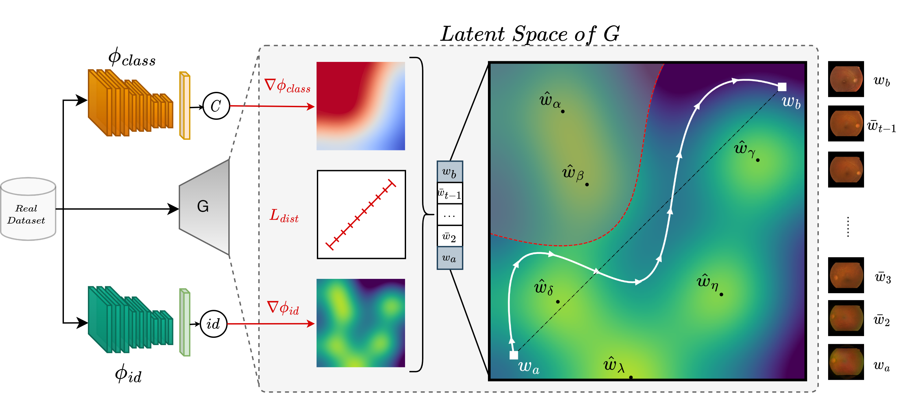
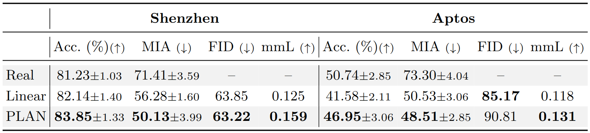
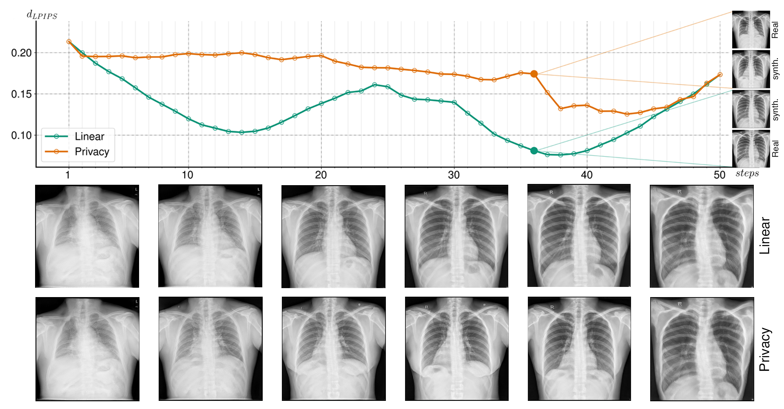

<div align="center">
  
# PLAN: A Privacy-Preserving Walk in the Latent Space of Generative Models for Medical Applications
  Matteo Pennisi, Federica Proietto Salanitri, Giovanni Bellitto, Simone Palazzo, Ulas Bagci, Concetto Spampinato
 
[]()
[]()
</div>

# Overview
Official PyTorch implementation for paper: <b>"A Privacy-Preserving Walk in the Latent Space of Generative Models for Medical Applications"</b>

# Abstract
<p align="justify">
Generative Adversarial Networks (GANs) have demonstrated their ability to generate synthetic samples that match a target distribution. However, from a privacy perspective, using GANs as a proxy for data sharing is not a safe solution, as they tend to embed near-duplicates of real samples in the latent space. Recent works, inspired by k-anonymity principles, address this issue through sample aggregation in the latent space, with the drawback of reducing the dataset by a factor of k. Our work aims to mitigate this problem by proposing a latent space navigation strategy able to generate diverse synthetic samples that may support effective training of deep models, while addressing privacy concerns in a principled way. Our approach leverages an auxiliary identity classifier as a guide to non-linearly walk between points in the latent space, minimizing the risk of collision with near-duplicates of real samples. We empirically demonstrate that, given any random pair of points in the latent space, our walking strategy is safer than linear interpolation. We then test our path-finding strategy combined to k-same methods and demonstrate, on two benchmarks for tuberculosis and diabetic retinopathy classification, that training a model using samples generated by our approach mitigate drops in performance, while keeping privacy preservation. 


# Method

<p align = "center"></p>

Using real samples, we train a GAN, an identity classifier  and an auxiliary classifier . Given two arbitrary latent points,  and  , PLAN employs  and  to gain information on latent space structure and generate a privacy-preserving navigation path (right image), from which synthetic samples can be sampled (far right images, zoom-in for details).

# Results

<p align = "center"></p>

Comparison between the model trained with real samples and those trained with synthetic samples generated from the linear path and privacy path, respectively.
Results demonstrate that our approach performs similarly to training with real data, but with higher accuracy with respect to the linear baseline. Privacy-preserving results, measured through  and , demonstrate the reliability of our PLAN strategy in removing sensitive information, reaching the ideal lower bound of  accuracy.


<p align = "center"></p>

Linear vs PLAN navigation between two arbitrary points. For each step of the latent trajectory, we compute the LPIPS distance between each synthetic sample and its closest real image. On the right, a qualitative comparison of images at step 35 and their closest real samples: the synthetic image obtained with PLAN differs significantly from its closest real sample; in linear interpolation, synthetic and real samples look similar. Bottom images show synthetic samples generated by linear interpolation and PLAN at the same steps (zoom-in for details).


## Pre-requisites:
- NVIDIA GPU (Tested on Nvidia GeForce RTX 3090)

# Citation

```bibtex

```
